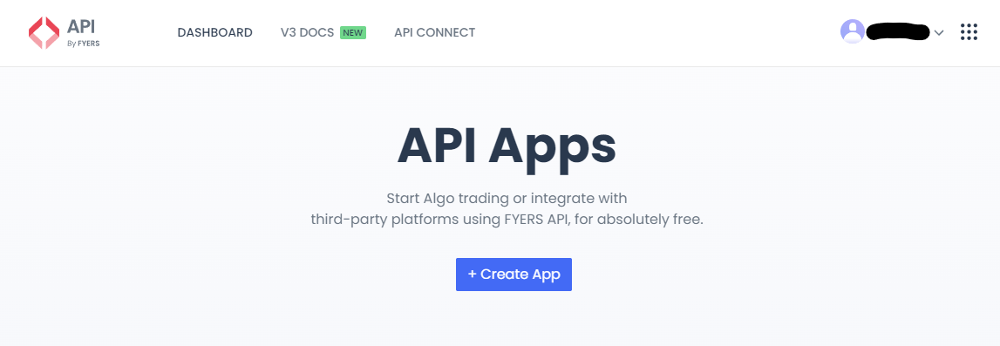
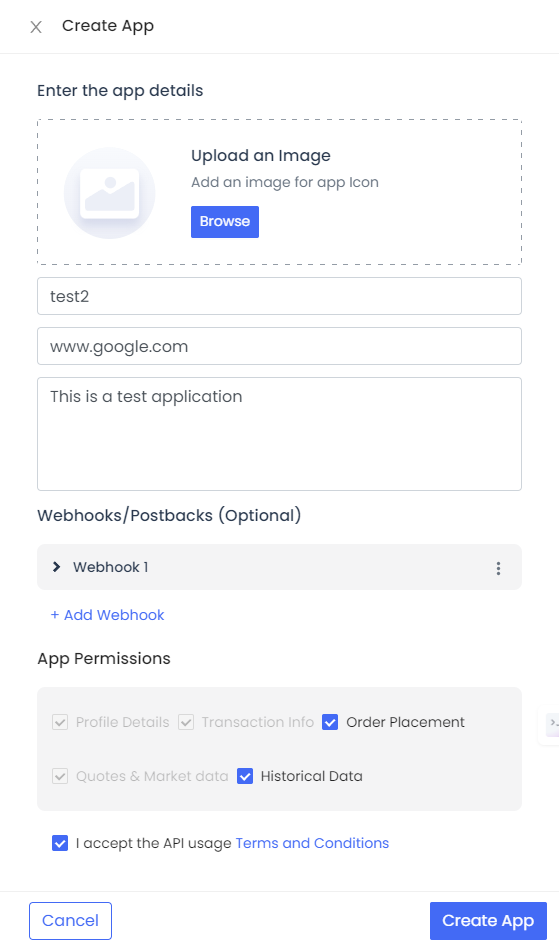
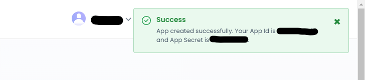
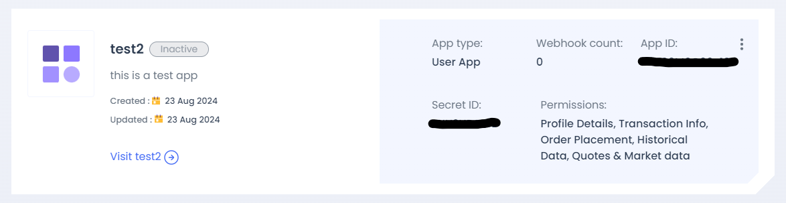
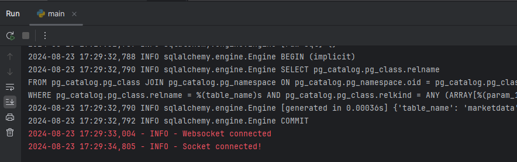
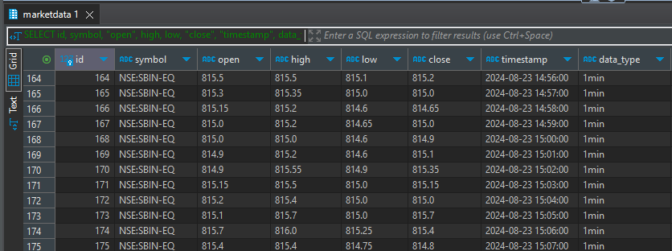

# Market-Stream-Metrics
Python backend to retrieve realtime market data for desired symbol(s), determine minute candle data and populate database.

# API used
Fyers API

# Requirements excluding libraries
1. Fyers trading account
2. API Auth Code (unique each day)
3. API Secret Key (unique each day)
4. Client ID
5. Secret Key
6. env file containing all above

# Create Fyers API
1. Login to Fyers account.
2. Navigate to API on https://myapi.fyers.in/dashboard
3. Create an app

   

4. Enter all required details

   

5. You will get your app ID and secret key

   

6. Your API dashboard will show your app

    

# API Integration
1. Fyers library and documentation: https://pypi.org/project/fyers-apiv3/
2. Required logs will be generated in the home directory by the library.

# Output:

1. CLI:

2. Database:

